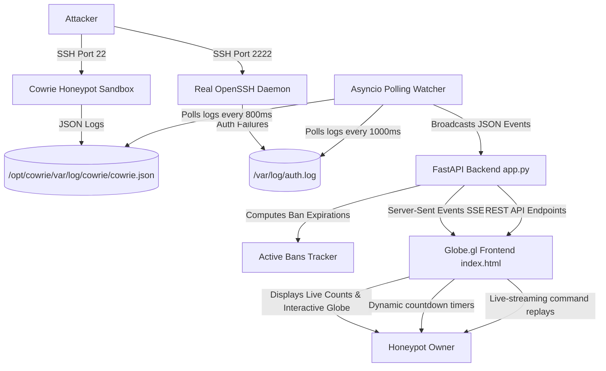

# Dashboard Features & Telemetry Overview

This document provides a detailed overview of the advanced telemetry, real-time tracking, and visualization features implemented in the **Fail2ban & SSH Honeypot Dashboard**. It also includes the system architecture visualization and planned future improvements.

---

## 📊 System Architecture & Data Flow

---

## 🌟 Implemented Features

### 1. Real-Time Command Streaming (Active Sessions)
* **Description:** Watch attacker behavior as it happens. When an active honeypot connection is selected in the **Interactive Session Analyzer**, the dashboard displays `[SYSTEM] ACTIVE CONNECTION DETECTED. Watching commands in real-time...`. 
* **Mechanism:** The backend broadcasts command inputs over a Server-Sent Events (SSE) stream. If the session ID matches the currently active playback panel, new command events are dynamically pushed to the playback queue and rendered instantly.
* **Benefit:** Eliminates the need to manually refresh the page or wait for a session to close to audit what the attacker is doing.

### 2. Space-Saving IP Grouping
* **Description:** Grouping multiple sessions originating from the same attacker IP into a single card in the sidebar.
* **Mechanism:** The frontend parses the live sessions array, aggregates them by IP, and creates a nested list of clickable `REPLAY` buttons under a single IP header.
* **Benefit:** Saves significant sidebar vertical space, prevents duplication, and groups all attacks from a single host chronologically.

### 3. Captured Commands Timeline
* **Description:** A dedicated column next to the virtual playback terminal listing all commands typed in the session (e.g. `whoami`, `rm -rf /`, `curl`).
* **Mechanism:** Filters `cowrie.command.input` events immediately upon session load and renders a clickable command list.
* **Benefit:** Allows you to instantly see the attacker's commands and intent without waiting for the terminal simulation animation to finish.

### 4. Dynamic Ban Expiry Countdown Timers
* **Description:** The **Recently Banned** panel displays a real-time countdown timer for each banned IP (e.g. `UNBAN IN 23h 11m 45s`).
* **Mechanism:** The backend `app.py` calculates the exact UTC epoch timestamp (`banned_until`) based on the jail's bantime configuration (24h for `cowrie`, 1w for `recidive`, 1h for others). The frontend runs a JavaScript `setInterval` loop ticking every second to calculate and render the remaining time.
* **Benefit:** Provides immediate visibility into when IP bans are scheduled to lift.

### 5. Top Attacking Networks (ASNs)
* **Description:** Identifies the Internet Service Providers (ISPs) and cloud providers hosting the attackers.
* **Mechanism:** Resolves MaxMind IP database info to fetch the Autonomous System Number (ASN) and Organization Name (Org) for each IP. Serves it via the `/api/asns/top` API endpoint.
* **Benefit:** Helps identify if the attacks are coming from compromised residential connections or large cloud providers (like DigitalOcean, Oracle, AWS, etc.).

### 6. Robust Asyncio Polling Watcher
* **Description:** Custom-built polling log tailer in [watcher.py](watcher.py) that monitors file state.
* **Mechanism:** Replaced the default OS watchdog observer (which relies on `inotify`) with an asyncio sleep loop checking file sizes and reading new offsets.
* **Benefit:** 100% reliable across virtualized filesystems, containerized environments, and cloud OCI environments where standard watchdog filesystem triggers often fail or lag.

### 7. Malware Payload Vault & Forensic Detonation
* **Description:** Real-time capture and forensic analysis of dropped binaries, worms, and botnet scripts.
* **Mechanism:** Intercepts `cowrie.session.file_download` and `file_upload` events, isolates dropped files in `/opt/cowrie/var/lib/cowrie/downloads/`, computes instantaneous SHA256 and MD5 hashes, and serves via `/api/malware` with 1-click links to VirusTotal and MalwareBazaar.
* **Benefit:** Provides instant malware telemetry, identifying whether incoming attacks are delivering Mirai variants, cryptominers, or custom rootkits.

### 8. MITRE ATT&CK Automated Tagger & Canary Honeytokens
* **Description:** Automatically classifies attacker commands using the MITRE ATT&CK framework and trips instant critical alarms if decoy honeytokens are touched.
* **Mechanism:** Implemented in `threat_intel.py`. Scans command streams for T1082 (System Discovery), T1016 (Network Discovery), T1105 (Ingress Tool Transfer), T1003 (Credential Dumping), and T1070 (Defense Evasion). Monitored honeytokens include fake `.aws/credentials`, `/var/www/html/.env`, `.ssh/id_rsa`, and shell history.
* **Benefit:** Instant visual understanding of adversary tactics, techniques, and procedures (TTPs), with flashing alarms on decoy compromise.

### 9. SSH Cryptographic HASSH Fingerprinting
* **Description:** Identifies threat actors and botnets across rotating IP addresses using SSH cryptographic handshake signatures.
* **Mechanism:** Parses Cowrie `cowrie.client.kex` events to calculate the client `hassh` fingerprint (MD5 hash of key exchange, cipher, MAC, and compression lists) and maps it against known tool signatures (e.g. Paramiko, Masscan, PuTTY, ZGrab, OpenSSH).
* **Benefit:** Spots distributed botnets coordinating attacks across multiple residential/cloud IPs using the same underlying exploit tool.

### 10. Native System Telemetry & Audio Radar Synthesizer
* **Description:** Real-time CPU, RAM, Disk, Active Sockets, and Network TX/RX speed metrics via native `psutil`, paired with a Web Audio API synthesized threat radar.
* **Mechanism:** Direct kernel query bypassing legacy external collectors; Web Audio API generates subtle sonar pings for scans and dual-tone warble alarms for root intrusions and honeytoken breaches.

---

## 🔮 Planned Future Improvements

| Feature | Difficulty | Planned Mechanism | Expected Benefit |
| :--- | :--- | :--- | :--- |
| **Elasticsearch/SQLite Persistence** | Medium | Migrate from in-memory array logs (`state["events"]`) to SQLite/PostgreSQL for long-term historical trends. | Months of historical querying. |
| **Interactive Terminal Takeover** | Hard | Allow the administrator to interactively inject shell commands back into live attacker sessions. | Active adversary engagement. |
| **LLM Dynamic Shell Backend** | Medium | Connect Cowrie to an LLM provider to dynamically generate realistic shell outputs for arbitrary unrecognized commands. | Endless deceptive depth. |

