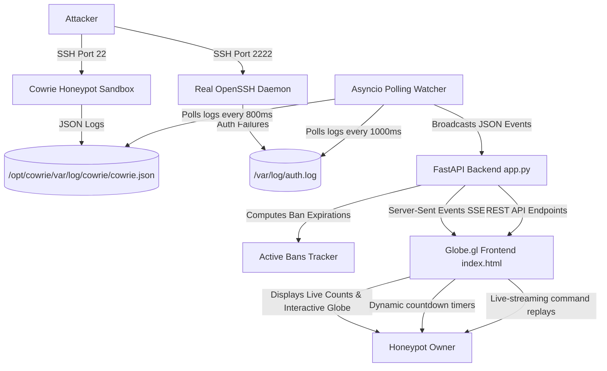

# Dashboard Features & Telemetry Overview

This document provides a detailed overview of the advanced telemetry, real-time tracking, and visualization features implemented in the **Fail2ban & SSH Honeypot Dashboard**. It also includes the system architecture visualization and planned future improvements.

---

## 📊 System Architecture & Data Flow

---

## 🌟 Implemented Features

### 1. Real-Time Command Streaming (Active Sessions)
* **Description:** Watch attacker behavior as it happens. When an active honeypot connection is selected in the **Interactive Session Analyzer**, the dashboard displays `[SYSTEM] ACTIVE CONNECTION DETECTED. Watching commands in real-time...`. 
* **Mechanism:** The backend broadcasts command inputs over a Server-Sent Events (SSE) stream. If the session ID matches the currently active playback panel, new command events are dynamically pushed to the playback queue and rendered instantly.
* **Benefit:** Eliminates the need to manually refresh the page or wait for a session to close to audit what the attacker is doing.

### 2. Space-Saving IP Grouping
* **Description:** Grouping multiple sessions originating from the same attacker IP into a single card in the sidebar.
* **Mechanism:** The frontend parses the live sessions array, aggregates them by IP, and creates a nested list of clickable `REPLAY` buttons under a single IP header.
* **Benefit:** Saves significant sidebar vertical space, prevents duplication, and groups all attacks from a single host chronologically.

### 3. Captured Commands Timeline
* **Description:** A dedicated column next to the virtual playback terminal listing all commands typed in the session (e.g. `whoami`, `rm -rf /`, `curl`).
* **Mechanism:** Filters `cowrie.command.input` events immediately upon session load and renders a clickable command list.
* **Benefit:** Allows you to instantly see the attacker's commands and intent without waiting for the terminal simulation animation to finish.

### 4. Dynamic Ban Expiry Countdown Timers
* **Description:** The **Recently Banned** panel displays a real-time countdown timer for each banned IP (e.g. `UNBAN IN 23h 11m 45s`).
* **Mechanism:** The backend `app.py` calculates the exact UTC epoch timestamp (`banned_until`) based on the jail's bantime configuration (24h for `cowrie`, 1w for `recidive`, 1h for others). The frontend runs a JavaScript `setInterval` loop ticking every second to calculate and render the remaining time.
* **Benefit:** Provides immediate visibility into when IP bans are scheduled to lift.

### 5. Top Attacking Networks (ASNs)
* **Description:** Identifies the Internet Service Providers (ISPs) and cloud providers hosting the attackers.
* **Mechanism:** Resolves MaxMind IP database info to fetch the Autonomous System Number (ASN) and Organization Name (Org) for each IP. Serves it via the `/api/asns/top` API endpoint.
* **Benefit:** Helps identify if the attacks are coming from compromised residential connections or large cloud providers (like DigitalOcean, Oracle, AWS, etc.).

### 6. Robust Asyncio Polling Watcher
* **Description:** Custom-built polling log tailer in [watcher.py](watcher.py) that monitors file state.
* **Mechanism:** Replaced the default OS watchdog observer (which relies on `inotify`) with an asyncio sleep loop checking file sizes and reading new offsets.
* **Benefit:** 100% reliable across virtualized filesystems, containerized environments, and cloud OCI environments where standard watchdog filesystem triggers often fail or lag.

---

## 🔮 Planned Future Improvements

Here is what can be added or improved in future iterations of the dashboard:

| Feature | Difficulty | Planned Mechanism | Expected Benefit |
| :--- | :--- | :--- | :--- |
| **Malicious Payload Sandbox Logger** | Medium | Log curl/wget URLs executed by the attacker and download files into a secure VM sandbox for automated MD5/SHA256 scanning. | Real-time malware intelligence. |
| **Elasticsearch/Database Persistence** | High | Migrate from in-memory array logs (`state["events"]`) to a persistent database (SQLite or PostgreSQL) to preserve months of log history. | Long-term threat analysis and historical querying. |
| **Interactive Terminal Input** | Hard | Allow the admin to "hijack" the terminal replay and interactively inject commands/fake outputs back to the attacker's shell. | Active defense and honeypot interaction. |
| **Attacker Fingerprinting (Hassh/SSH Client ID)** | Easy | Cache and display Hassh client key exchanges to identify attackers who rotate their IP addresses but use the same tool. | Advanced bot identification. |
